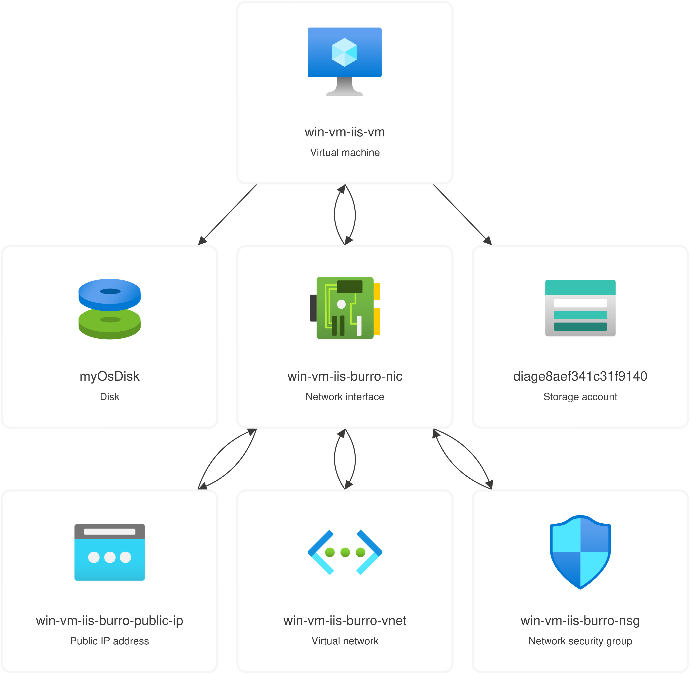

# cloud-labo-SIEM-SOAR
Repository pour le labo 2 de Cloud (SIEM - SOAR) ou nous devons deployer une infrastructure vulnérable dans Azure.

Créé en utilisant le guide ["Quickstart: Use Terraform to create a Windows VM"](https://learn.microsoft.com/en-us/azure/virtual-machines/windows/quick-create-terraform).

